# YA-SAAS-JOKE-APP

Laravelを使用して開発した、ジョークの投稿・管理を行うWebアプリケーションです。

LaravelにおけるWebアプリケーション開発の基礎を学ぶことを目的として、MVCアーキテクチャ、認証、CRUD、データベースリレーション、ルーティング、ユーザー権限管理に加え、Livewireを使用したインタラクティブな機能を実装しました。

## プロジェクト概要

ユーザーがジョークを閲覧・投稿・編集・削除できるWebアプリケーションです。

ジョークには複数のカテゴリーを設定できるほか、Livewireを利用したLike / Dislike機能を実装しています。また、ユーザーのロールに応じて利用できる機能を制御しています。

このプロジェクトを通して、Laravelを使用したWebアプリケーションにおける、リクエストからデータベース処理、画面表示までの基本的な流れを実装しながら学習しました。

## 主な機能

- Home・Aboutなどの静的ページ表示
- ユーザー登録・ログイン・ログアウト
- セッションを利用したログイン状態の管理
- ジョークの一覧表示
- ジョークの新規登録・編集・削除（CRUD）
- ジョークへの複数カテゴリーの設定
- ジョークとカテゴリーの多対多（Many-to-Many）リレーション
- Livewireを使用したジョークへのLike / Dislike機能
- Users・Jokes・Votes・Categories間のデータ管理
- ユーザーロール・権限によるアクセス制御
- Admin / Staff / Clientのロール管理
- Laravel Routingを使用したHTTPリクエストの振り分け
- Tailwind CSSを使用したUI
- レスポンシブ対応

## 技術的に学んだこと

### MVCアーキテクチャ

LaravelのMVCパターンを使用し、Model・View・Controllerの役割を分けてアプリケーションを構築しました。

- **Model**：データベースとのやり取りやリレーションを定義
- **View** ：ユーザーに表示する画面を担当
- **Controller**：リクエストを受け取り、ModelとViewをつなぐ処理を担当

これにより、Laravelにおける基本的なリクエスト処理の流れを理解しました。

### データベースリレーション

ジョークとカテゴリーの関係には、多対多（Many-to-Many）のリレーションを実装しました。

1つのジョークに複数のカテゴリーを設定でき、同じカテゴリーを複数のジョークで使用できる構成です。

この実装を通して、Laravel Eloquentを使用したモデル間のリレーションと、中間テーブルを利用したデータ管理について学習しました。

### 認証・権限管理

ユーザー登録・ログイン・ログアウトなどの基本的な認証機能に加えて、ユーザーのロールに応じた権限管理を実装しました。

Admin・Staff・Client Userなどのロールに応じて利用できる機能を制限することで、Webアプリケーションにおける認証・認可とアクセス制御の基本を学習しました。

### Livewireによるインタラクティブ機能

ジョークに対するLike / Dislike機能にはLivewireを使用しました。

ページ全体を再読み込みすることなくユーザー操作に応じて表示を更新する機能を実装し、LaravelとLivewireを組み合わせたステートフルなUIコンポーネントの基本を学習しました。

## 使用技術

- PHP
- Laravel
- MySQL
- SQLite
- Blade
- Livewire
- Tailwind CSS
- HTML / CSS
- JavaScript
- Composer
- npm
- Git / GitHub
- Laragon

## 開発環境

- PHP 8.4.10
- Composer 2.8.11
- MySQL 8
- npm 11.4.2
- Laragon

## セットアップ

1. リポジトリをクローン

`git clone <repository-url>
cd ya-saas-jokes-app`

2. PHP依存パッケージをインストール

`composer install`

3. Node.js依存パッケージをインストール

`npm install`

4. 環境変数を設定

`.env.example` をコピーして `.env` を作成します。

`cp .env.example .env`

データベース接続情報など、必要な環境変数を設定してください。

5. Application Keyを生成

`php artisan key:generate`

6. データベースを作成

`php artisan migrate --seed`

Migrationによるテーブル作成と、Seederによるテストデータの登録を行います。

7. アプリケーションを起動

`php artisan serve`

ブラウザから以下へアクセスします。

http://127.0.0.1:8000

## 使用方法

1. アプリケーションへアクセス

2. 新規ユーザーを登録、またはSeederで作成されたテストユーザーでログイン

3. ジョークの一覧を表示

4. ジョークの追加・編集・削除

5. ジョークにカテゴリーを設定

6. 管理者ユーザーの場合、ユーザー・ロール・カテゴリーなどの管理機能を利用

## テスト

Seederで作成したテストユーザー・カテゴリーを使用し、主に以下の機能について手動テストを実施しました。

- ユーザー登録
- ログイン・ログアウト
- ジョークのCRUD
- カテゴリー管理
- ユーザーロールごとのアクセス・操作
- ジョークとカテゴリーのリレーション

## このプロジェクトで得た経験

このプロジェクトでは、Laravelを使用したWebアプリケーション開発の基礎として、MVC、Routing、CRUD、認証・認可、Eloquent ORMによるデータベース操作とリレーションを実際に実装しました。

特に、単純なデータの登録・表示だけでなく、ジョークとカテゴリーの多対多リレーションやユーザーロールによる権限管理を実装することで、複数のテーブルやユーザー権限を扱うWebアプリケーションの基本構造を学びました。

## 開発者

Yusho Aoyama

## License

このプロジェクトは学習・課題制作を目的として開発したものです。

## Usage

Once the server is running:

1. Open your browser and go to `http://127.0.0.1:8000`.
2. Register a new user or log in using the seeded test users.
3. Navigate through the application to view jokes, categories, and admin features (if logged in as an admin).

## スクリーンショット

### ホーム画面

#### ログイン前

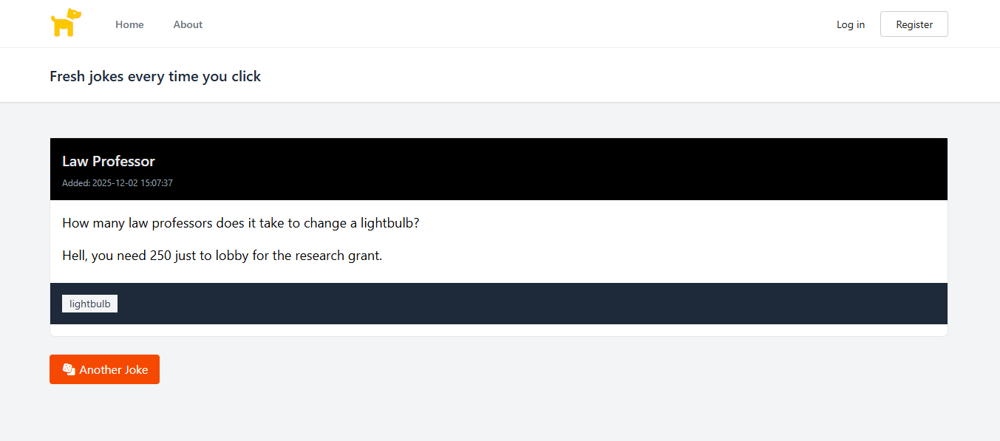

未ログインユーザー向けのホーム画面です。
登録されているジョークがランダムで１つ表示されます。

#### ログイン後

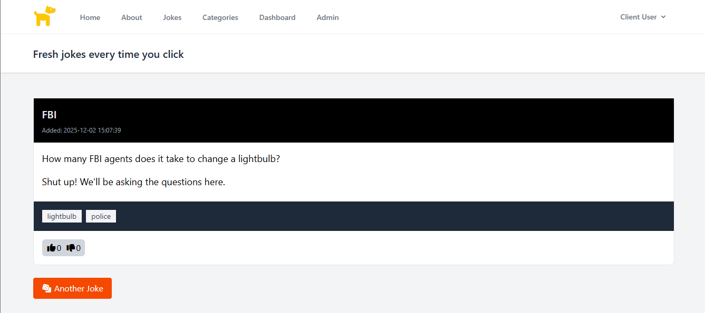

ログイン後のホーム画面では、ランダム表示されたジョークへ評価(Like・Dislike)ができます。

### ログイン画面

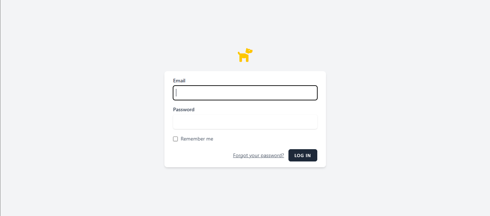

### ログイン後のダッシュボード画面

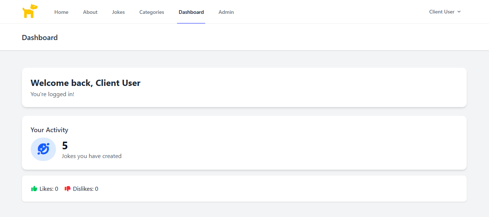

ログイン後、自身の投稿したジョークの数やLike・Dislike数などのステータスが確認できます。また、メニューからユーザー向けの機能へアクセスできます。

### ジョーク・カテゴリー 一覧

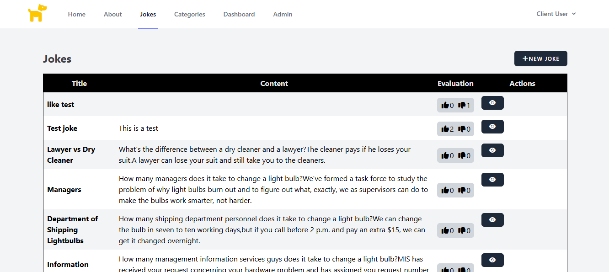

登録されているジョーク一覧を確認できます。

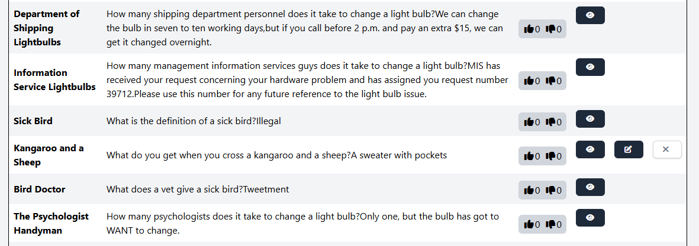

自身が登録したジョークのみ編集・削除ができます。

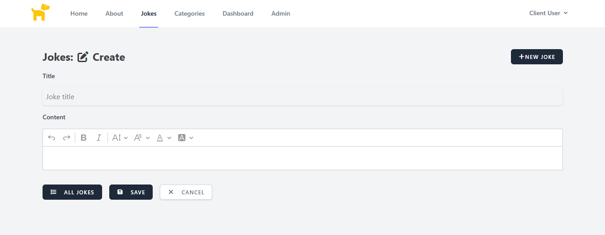

ジョークを新規作成する画面です。

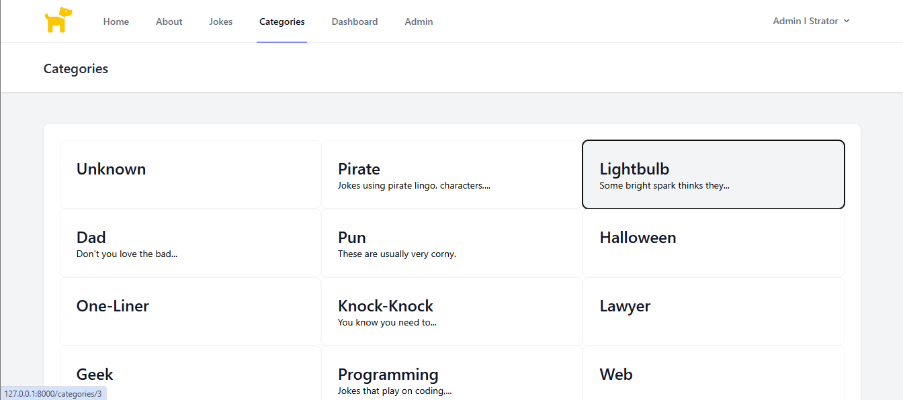

登録されているジョークとカテゴリーを確認できます。

### プロフィール画面

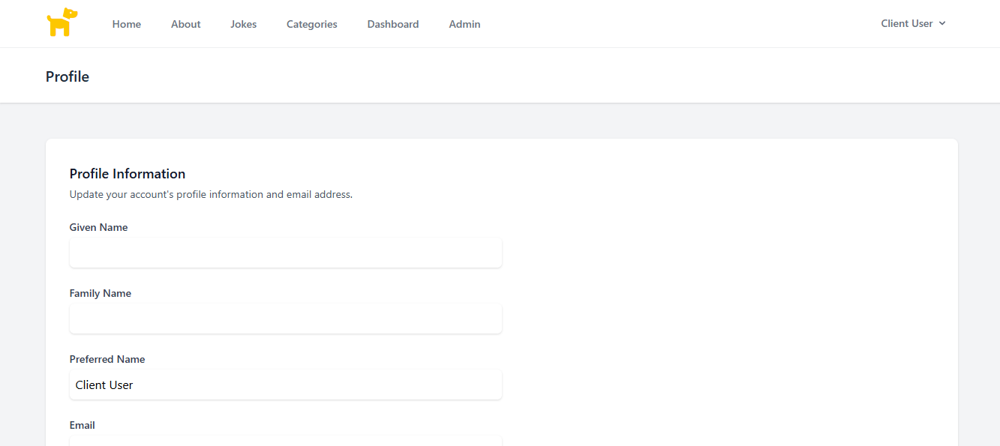

ユーザーは自身のプロフィール（名前・メール・パスワード）を編集または削除できます。

### About画面

アプリケーションについての情報を表示する静的ページです。

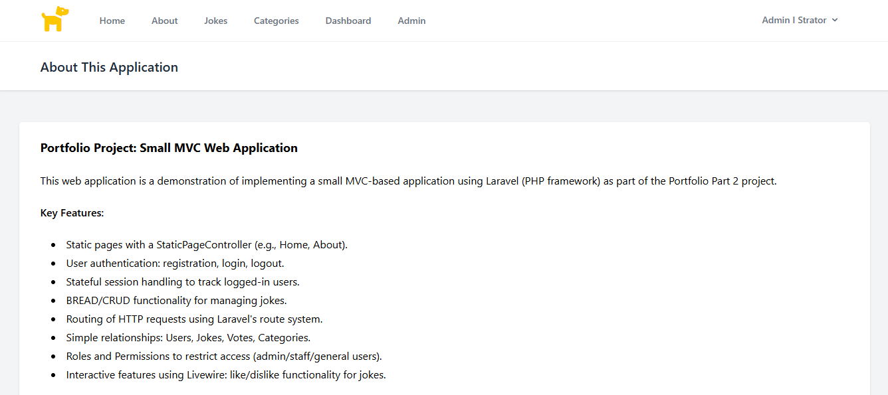

### 管理者画面 - ダッシュボード

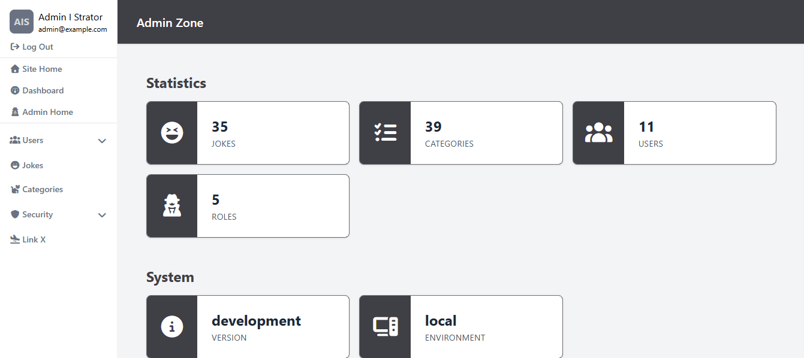

管理者ユーザーは、ユーザーやロールなどの管理機能を利用できます。

### 管理者画面 - ユーザー

#### ユーザーリスト

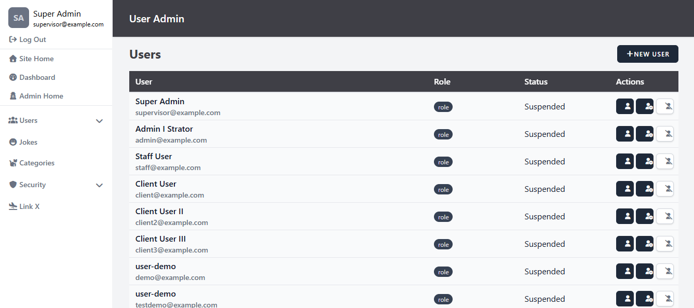

ユーザー一覧を閲覧できます。

#### ユーザー作成

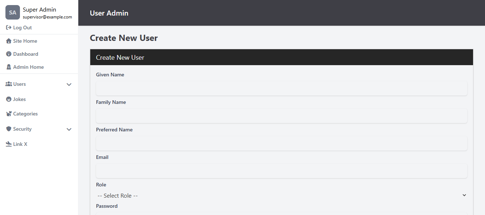

ユーザーを作成する画面です。

#### ユーザー詳細

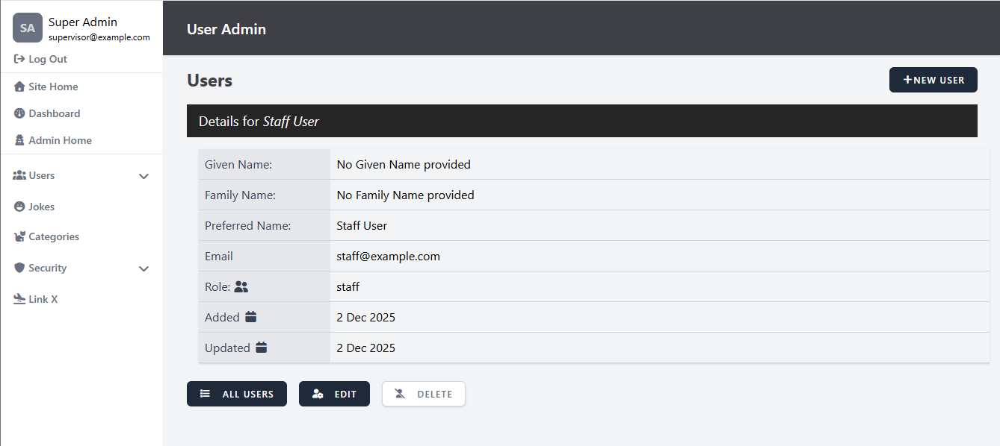

ユーザーの詳細情報を閲覧する画面です。

#### ユーザー編集

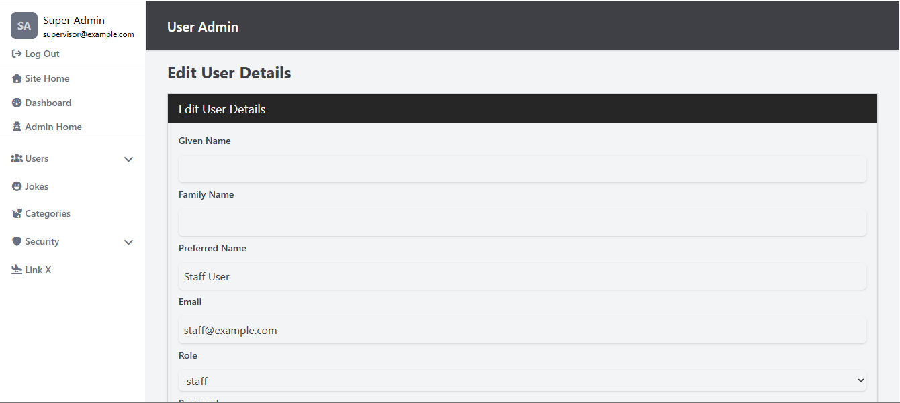

ユーザーの情報を編集する画面です。
名前・ロール・メールアドレス・パスワードを編集できます。

### 管理者画面 - ロール

#### ロールリスト

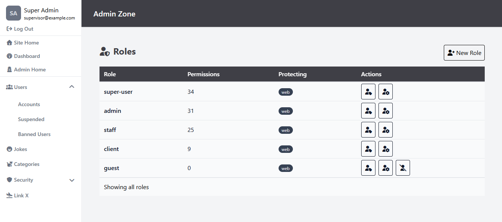

ユーザーロール一覧を閲覧できます。

#### ロール詳細

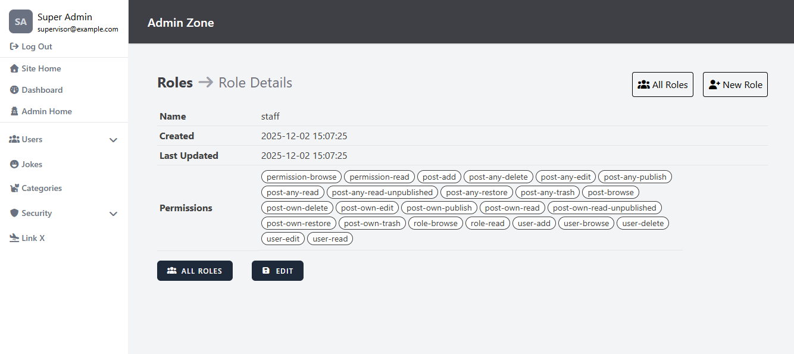

ロールの詳細情報を閲覧する画面です。

#### ロール編集

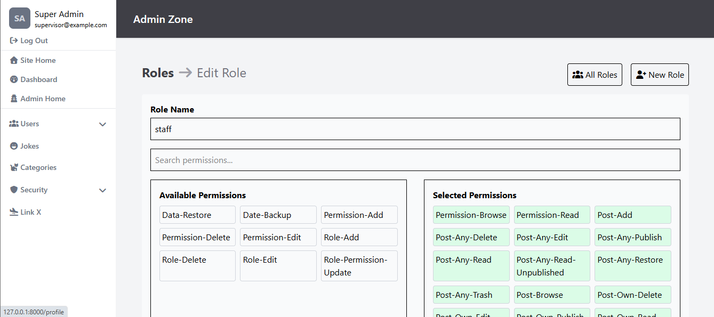

ロールの情報を編集する画面です。
ロールの名前・権限を編集できます。
